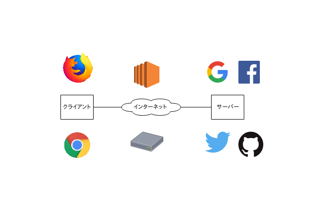
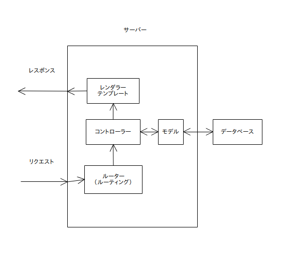
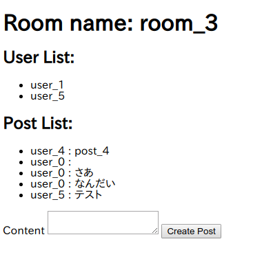
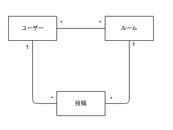
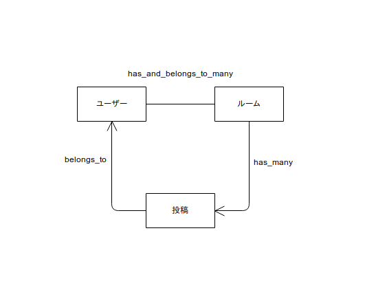

id: basic_concept_by_rails
# railsで学ぶウェブアプリケーションの基礎概念

## 概要

ウェブアプリケーションを作る上で必須の知識のうち、サーバーサイドプログラミングの基本的な概念を学ぶ

### やること

* ルーティング、レンダリングといった、アクセスされたときの実際の挙動
* モデルやデータベースのマイグレーションなどの概念と手順
* (簡易的な)モデル設計
* モデル同士のアソシエーション

### やらないこと

* Railsの詳細を知らないと実装できないこと
* CSSコーディングの技法
* デザイン方法論
* jQueryなどのライブラリー
* Vue,React,Angular,Elm,HyperAppなどのフレームワーク

### 必要な環境

* Ruby 2.5.1
* Mysql 5.7
* Rails 5.2

講習会では、これに加えてGit,anyenv,rbenv,Google Chrome,Visual Studio Codeをインストールしたものを仮想マシンとして配布しています。
さらに、Mysqlのrootユーザーにパスワードなしで入れるように設定もしてあります。
仮想マシンのデスクトップには、今回の講習会でできあがるものサンプルも置いてあります。(simple-chat)

## ページが表示されるまで

サーバーサイドプログラミングの前に、ウェブページの基本的なフローを改めて見た上で、「サーバーサイド」とはどれくらいなのかを確認します。

### ウェブサービスの概要



現在のウェブサービスの殆どは「クライアント - サーバーシステム」というシステムに当てはまります。
つまり、ブラウザなどのクライアントがインターネットを介してサーバーと通信するというシステムです。

Positive
: 「殆ど」と言ったように、中にはサーバーを介さずに直接クライアント同士が繋がっている、なんていうシステムも存在します。

より具体的には以下のようなステップを踏んでいます。

1. クライアントがリクエストを送る
1. ネットワークがそのリクエストを正しくサーバーまで届ける
1. サーバーがリクエストに応じてレスポンスを返す
1. ネットワークがそのレスポンスを正しくクライアントまで届ける
1. クライアントがレスポンスに応じて結果を表示する

### ウェブの世界の大まかな住み分け

これらのすべてについてそれぞれプログラミングで制御できるのですが、すべての分野に精通するのは難しいので、以下のようにある程度分業がされています。
きれいに分離できるわけではなく、ある程度重複も発生します。

- クライアントサイド(1,5)
- インフラストラクチャー(2,4)
- サーバーサイド(3)

それぞれ、かっこの中の数字が対応しています。また、クライアントサイド、サーバーサイドでのエンジニアリングができる人をフロントエンドエンジニア、バックエンドエンジニアと呼んだりします。

Positive
: 実際は2つ以上できる人が多いです。今の所最低限サーバーサイドかクライアントサイドのどちらかができれば独自のウェブサービスを作ることができますが、それでも他の分野の知識はかなり要求されます。

### サーバーサイドとは

つまり、サーバーサイドプログラミングとは、「リクエストに応じてレスポンスをいかに返すか」というものであると言えます。

では、リクエストを受け取ってからレスポンスを返すまで、サーバーの中では何が起こってるのでしょうか？


## レスポンスを送るまで

レスポンスを返すまでの流れを通じて、ルーティングなどのいくつかの概念を確認します。たくさん用語が出てきて大変だと思いますが、あとで何回もこの図は見ることになると思うので、いまはひとまず「そういうことなんだ」と思っておいてください。



### ルーティング

最初にリクエストが届くと、そのデータ（基本的にはURL）をもとに、どの処理が呼び出されるのかがまず処理されます。例えば、`GET /users/list `だったら「ユーザー一覧を取得する関数」が呼ばれる、といった感じです。この振り分けの段階をルーティングと呼びます。

### データベース

データベースです。（説明になってない。）
データがたくさん入っています。（これも説明になってない。）

### モデル

データベースのデータに対する操作や、データ同士の相関をプログラムで表現したものです。例えば、` User `モデルだったら、「年齢を更新する」だったり、「` Profile `オブジェクト（プロファイル）を持っているので、それを更新する。」だったりといったメソッドが生えています。
一般的に、アプリケーションを通じて実現したいことはモデルで表現し、コントローラーなどはそれを表示したり変換したり操作したりするだけの場合が多いです。

### コントローラー

モデルを操作したり変換したりして、レンダラーにデータを渡します。
たとえば、先程の`GET /users/list `の場合だと、「` User `のすべてのデータを取得して、一覧をレンダラーに渡す」といったふうになります。

### レンダラー（テンプレート）

先程のコントローラーから受け渡されたデータを加工して、レスポンスの形にするのはここです。レスポンスといっても色々あり、画像だったりjsonだったりすることもありますが、普通はHTMLの文字列の形にデータを変換して吐き出すことが多いです。

## 作りたいもの

一応基本概念をざっとさらったので、いよいよ作り始めるわけですが、その前にどんなアプリケーションを作るかを考えます。

### 画面



デザインの欠片も存在しない殺風景な画面ですが、実装するとこんな感じになります。
作るアプリは、L○NEのような、グループでトークができるもの（の劣化版）です。

### ユースケース

画面を見ると、だいたいこんな機能がほしいなあとなってきます。

- ルームにある投稿一覧を表示する
- 投稿に対応するユーザーを表示する
- ルームにいるユーザーを一覧表示する

また、以下のような機能もあったほうが良さそうです。

- 自分の参加している部屋の一覧を表示する

さらに、今回はログインなどを実装しない代わりに、以下の画面をつくることにします。

- ユーザーの一覧を表示する

Positive
: 今回は一応できたものが既にあったので、それを使ってしまいましたが、実際は紙などで画面の概要を書いたりしてほしいものを考えることが多い気がします。アプリケーションをつくる工程の中では一番夢がある楽しい工程です。

## モデルを考える

ユースケースを考えた次は、これを実現するのに必要なモデルを考えます。

### 登場人物を考える

モデルを作る一番簡単な方法の一つである、「名詞・動詞分析法」っぽいことをしながらモデルを考えていきます。
まずは、先程のユースケースから「名詞」を洗い出すとこんな感じになります。

- ユーザー
- ルーム
- 投稿

「一覧」とかはひとまず置いておくとします。

### 登場人物同士の相関を考える

この3つを見ると、以下のような相関があることがわかります。

- 投稿には必ず一つのユーザーが対応する
- ルームには複数の投稿がある
- ルームには複数のユーザーがいる
- ユーザーは複数のルームに入っている

### 簡単なモデルの図

以上を踏まえた上でモデルの簡単な図を書くと以下のようになります。



ユーザーと投稿とルームがそれぞれ線で結ばれていています。また、ユーザーと投稿を結ぶ線のユーザー側には「1」、投稿側には「*」が書かれていますが、これは、「ユーザー1つと投稿複数が対応している」ということを表しています。また、ユーザーとルームについては、「ユーザー複数とルーム複数が対応している」ということを表しています。

### 今回やらなかったこと

今回は名詞を洗い出しただけで、実際の「一覧を取得」だとか「追加」といったものをまるで考えませんでした。本来ならばもちろんこのステップも必要なのですが、今回考えなかったのは、Ruby on Railsがそういった「よくあるユースケース」を自動で実装してくれるためです。

### 参考になる情報

- [良い設計モデルの作り方](http://www.itmedia.co.jp/im/articles/0403/31/news077.html)

## モデルを実装する

モデルをデータベースのルールとして実装します。Railsの便利機能をいっぱいに使っていきますが、他の言語での実装でも参考になる事項が多いです。

### モデルにフィールドを足す

前の項でモデルを定義したものの、これだけでは実装には少し足りませんので、いくつか情報を補足してやることにします。

まずは、「フィールド」です。例えば、最低限以下のようなフィールドが必要になります。

- ユーザー → ユーザー名
- 投稿 → 投稿内容
- ルーム → ルーム名

### モデル同士の相関を付け足す

実はこれでもまだ足りなくて、これに加えて、モデル同士の「関連付け」を行ってやる必要があります。

[Active Record の関連付け (アソシエーション)](https://railsguides.jp/association_basics.html)のページにあるアソシエーションに基づいてもう一回モデルを整理すると、以下のようになります。



一つひとつ解説していきます。

- belongs_to

1対1の関係を表します。今回は、投稿(post)がユーザー(user)に属している(post belongs_to user)という形で使用しています。これにより、postからuserを読むことが可能になります。実装の上では、postに「user_id」というフィールドを要求します。

Negative
: 似た関係に「has_one」がありますが、「post has_one user」という関係性を作成してしまうと、userからpostは読めるものの、postからuserは読めなくなってしまいます。また、「user has_one post」とすると、今度はユーザーが一つの投稿しか持てなくなってしまいます。

- has_many

1対多の関係を表します。今回は、ルーム(room)が投稿(post)をたくさん持っている(room has_many posts)という形で使用しています。これにより、roomからpostの一覧を読むことが可能になります。実装の上では、postに「room_id」というフィールドを要求します。

Positive
: 実装の上ではこれは「post belongs_to room」とほとんど同じです。実際、has_manyとbelongs_toは併用されることが多いです。今回使用しなかったのは、単純にpostからroomを読む必要がなかったためです。

- has_and_belongs_to_many

多対多の関係を表します。今回は、ユーザー(user)とルーム(room)が多対多である(user has_and_belongs_to_many room)という形で使用しています。これにより、ユーザー、ルーム
がそれぞれ、自分と関係のある相手の一覧を取得することが可能になります。実装の上では、「user_idとroom_id」が対になった情報が入った「中間テーブル」を必要とします。

Positive
: 多対多の関係性にはhas_many :throughというものありますが、今回これをしなかったのは、「関係性そのものに対する属性」(いつ参加したか)などが必要無いためです。

Positive
: 残念ながら、プログラムを組む前にモデルが全てわかるケースはそんなには無いです。また、全て決まっていても、その変更で変わることは容易にありえます。しかし、「変わらないであろう場所」と「変わりうるであろう場所」をある程度予測してモデル化することで変更に強いシステムを設計することができます。これは、短期間、比較的小規模のプロジェクトでも有効です。

### railsプロジェクトの作成とモデルの作成

ようやく実装です。ターミナルを起動して、以下のコマンドを順番に打ち込みましょう。

```bash
cd ~/desktop
# railsのプロジェクトを作成
rails new test_chat -d mysql -B
cd test_chat/
# エディタを起動
code .
```

すると、ファイルがたくさん作成されてから、エディタが開くと思いますので、` Gemfile `の以下の行の先頭の「#」を消して保存します。


```Gemfile
# gem 'mini_racer', platforms: :ruby
```

そして、以下のコマンドを順番に打ってください。

```bash
# 依存パッケージをインストール
bundle install
# データベースを作成
rake db:create
# モデルを作成
rails g model user name:string
rails g model room name:string
rails g model post content:string room_id:integer user_id:integer
```

すると、ファイルがまたたくさん作成されると思います。

### 自動で作りきれない分を実装する

./db/migrateフォルダの中のusers,rooms,postsファイル、
そして、./app/modelsの中のusers,rooms,postsファイルを、同じデスクトップにある「simple-chat」の中身を参考に実装してください。(コピペでいいです)そして、以下のようなコマンドを実行してください。

```bash
rake db:migrate
```

うまくいったら、` mysql -uroot `と打って、以下のように打つとテーブルができていることがわかると思います。

```mysql
use test_chat_development;
show tables;
```

## データを入れてみる

先程のモデル実装では、データベースのいわば「枠」を書き込んだだけですので、中身がありません。
しかし、実際の開発では仮のデータがあると便利な場面が多いですので、実際にデータを投入してみます。

### シードファイルの作成と実行

実際にデータを投入するためには、./db/seedsファイルを編集し、以下のコマンドを実行すれば大丈夫です。

```bash
rake db:seed
```

先程開いたmysqlのターミナルで、以下のように打ってみましょう。また。usersのところを他のものに変えていろいろ試してみましょう。

```mysql
select * from users;
```

いろいろ追加されているのがわかると思います。

## データを表示してみる

これでデータが追加されましたので、ようやく表示する準備が整いました。実際にコントローラー、ルーティングを作成し、表示をしてみます。

### コントローラーの追加

Ruby on Railsでコントローラーを追加するのは非常に簡単です。以下のコマンドを打ってください。

```bash
rails g controller rooms show
```

すると、ファイルが作成されると思いますので、./app/controllers/rooms_controllerを実装してください。

### ルーティングの実装

そのままですとルーティングがなされないので、./config/routes.rbを以下のように書き換えます

```ruby
Rails.application.routes.draw do
  get 'rooms/show/:room_name/:user_name' => 'rooms#show'
  # For details on the DSL available within this file, see http://guides.rubyonrails.org/routing.html
end
```

### テンプレートの編集

残すはあとはテンプレートの編集のみです。以下のコードを./app/views/rooms/show.html.erbに貼り付けてみてください。

```erb
<h1>
    Room name: <%= @room[:name] %>
</h1>

<h2>User List:</h2>
<ul>
    <% @room.users.each do |user|%>
    <li>
        <%= user[:name] %>
    </li>
    <% end %>
</ul>

<h2>Post List:</h2>
<ul>
    <% @room.posts.each do |post|%>
    <li>
        <% user = post.user %>
        <%= user.name %> : <%= post[:content] %>
    </li>
    <% end %>
</ul>
```

そして、以下のコマンドを打って、ブラウザで「localhost:3000/rooms/show/room_0/user_0」にアクセスしてみてください。

```bash
rails s
```

うまく表示されたらおめでとうございます！

## データを追加してみる

今回はmodelから作っていきましたが、今回は逆にレンダリング側からつくってみます。

./app/views/rooms/show.html.erbに以下のコードを追加してください

```erb
<%= form_for Post.new do |f| %>
    <%= f.hidden_field :user_name, :value => @user.name %>
    <%= f.hidden_field :room_name, :value => @room.name %>
    <%= f.hidden_field :user_id, :value => @user.id %>
    <%= f.hidden_field :room_id, :value => @room.id %>
    <%= f.label :content %>
    <%= f.text_area :content %>
    <%= f.submit %>
<% end %>
```

この状態で先程のページにアクセスすると、今度はエラーが出てきます。これは、要は「postする先が存在しないけれどどうするの」ということです。なので、./config/routes.rbに以下のコードを書き足してやります。

```ruby
  post 'posts' => 'posts#create'
```

すると、今度は、「そんな関数はない」というエラーが出てくると思うので、コントローラーを以下のコマンドでターミナルから追加してやります。

```bash
rails g controller posts
```
最後に、sample-chatを参考に./app/controllers/posts_controller.rbのコードを書いて実行してみると、今度は投稿もできるようになっているはずです！

## 発展的な課題

その他simple-chatには、簡単な一覧表示などがありますが、ひとまずこれで最低限はいいでしょう。
あえて今回作らなかったところは、2週間以内に書いてきたら2週間以内にコードレビューします！

- 退出できるようにしてみよう
- 部屋を作れるようにしてみよう
- 部屋に参加できるようにしてみよう
- サインインができるようにしてみよう
- ログイン、ログアウトができるようにしてみよう
- 今回の実装でやばい箇所の改善
- その他機能追加
